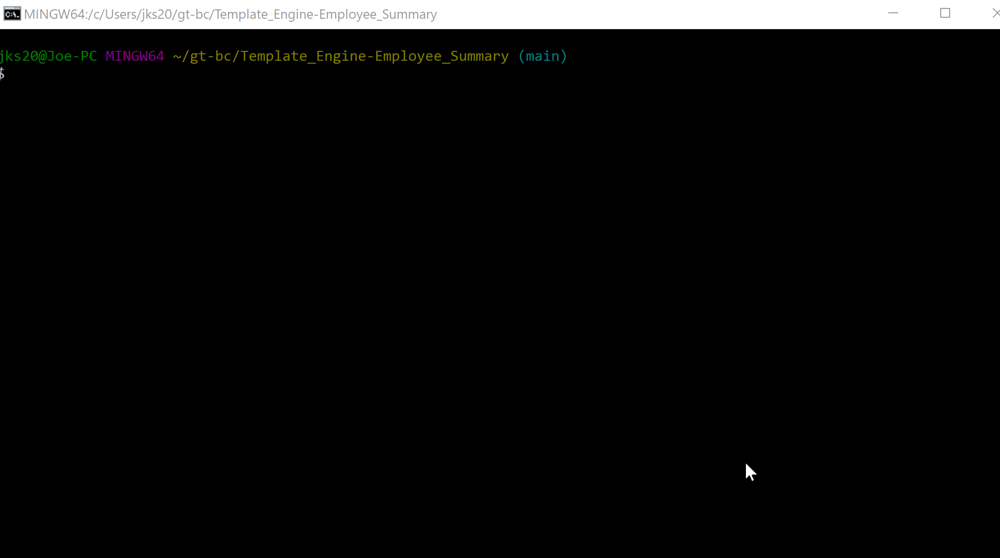
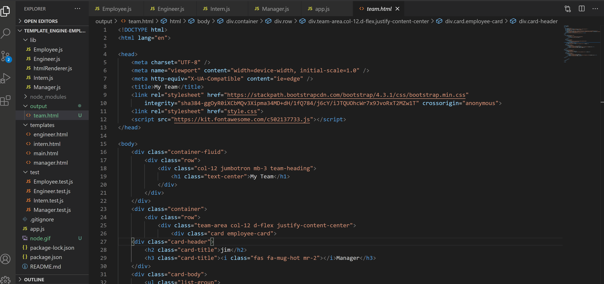

# Template_Engine-Employee_Summary

# Purpose

To create an html page that includes any number of given fields of managers, interns, and engineers

# Method

The Template Engine uses inquirer to ask a series of questions pertaining to each unique employee type, then it passes user input into an array. The app then takes that array, and writes an html file using the data given. 

# Demonstration

Using inquirer prompts:

Final result:

# Conclusion/End Result

The Template Engine performs as expected, fields a set of questions to the user on which employee they want to add to their web page, then follows up with basic questions about each employee type, and then writes the file. The file in turn is generated using the input.

